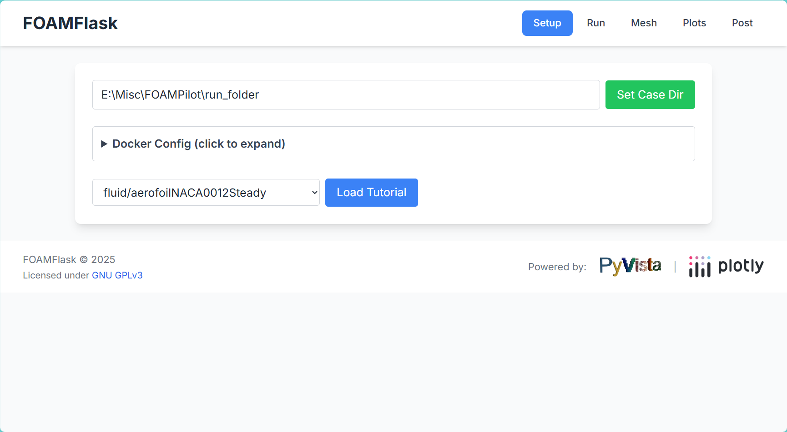

[](https://opensource.org/licenses/GPL-3.0)
[](https://www.python.org/)
[](https://flask.palletsprojects.com/)
[](https://www.typescriptlang.org/)
[](https://tailwindcss.com/)
[](https://openfoam.org/)
[](https://pdoc3.readthedocs.io/)

# FOAMFlask

**FOAMFlask** is an attempt to make a yet another lightweight web-based GUI for managing and running **OpenFOAM** tutorials and simulations. It allows users to easily select a tutorial, set a case directory, and execute OpenFOAM commands directly from a browser. Since this is targeted for beginners, the documentation has been kept as extensive as possible.

**Note**: Currently only loading and execution of OpenFOAM tutorials (`$FOAM_TUTORIALS`) is supported. Creating custom cases is planned.

---

## Features

- Web interface for OpenFOAM case management.
- Persistently store the **CASE_ROOT** across sessions.
- Load and copy tutorials from the OpenFOAM tutorials directory.
- Run common OpenFOAM commands (`blockMesh`, `simpleFoam`, `pimpleFoam`) with live output.
- Color-coded console output for stdout, stderr, info, and tutorial messages.
- Fully compatible with OpenFOAM 2506 (adjustable for other versions).
- **Security-hardened command execution** with input validation and injection protection.

---

## Installation

1. **Clone the repository**:

```bash
git clone https://github.com/dhruvhaldar/FOAMFlask
cd FOAMFlask
```

2. **Install Python dependencies**:
```bash
pip install -r requirements.txt
```

3. **Install Node.js dependencies** (for TypeScript compilation):
```bash
npm install
```

4. **Build the frontend**:
```bash
npm run build
```

### Frontend Build Process

FOAMFlask uses TypeScript for the frontend, which provides type safety and better development experience. The build process compiles TypeScript to browser-compatible JavaScript:

- **Source**: `static/ts/foamflask_frontend.ts` (TypeScript)
- **Compiled**: `static/js/foamflask_frontend.js` (JavaScript)
- **Process**: TypeScript compiler (`tsc`) + custom copy script

#### Build Commands:
```bash
npm run build          # Compile TypeScript to JavaScript
npm run build:watch    # Watch mode: auto-compile on file changes
```

The build process:
1. Compiles TypeScript (`static/ts/*.ts`) to JavaScript (`static/js-build/*.js`)
2. Copies compiled files to `static/js/` directory
3. Removes Plotly import (since Plotly is loaded via CDN)
4. Makes the frontend ready for browser deployment

**Note**: You must run `npm run build` after making any TypeScript changes for them to take effect in the browser.

## Usage
1. **Run the server**:
```bash
python app.py
```
2. **Access the web interface**:
Open your browser and navigate to `http://localhost:5000`.

3. **Set a case directory**:
Enter a path for your simulation cases.
Click `Set Case Dir`.

4. **Set OpenFOAM root directory**:
Enter a path for your OpenFOAM root directory.
Click `Set OpenFOAM Root`.

5. **Load a tutorial**:
Select a tutorial from the dropdown.
Click `Load Tutorial`.
The tutorial will be copied to your selected case directory.

6. **Run OpenFOAM commands**:
Use the buttons (blockMesh, simpleFoam, pimpleFoam) to execute commands.
Live output is shown in the console panel.

---

## Development

### Frontend Development Workflow

1. **Make changes to TypeScript files** (`static/ts/*.ts`)
2. **Compile to JavaScript**:
   ```bash
   npm run build        # One-time build
   npm run build:watch  # Auto-compile on changes (recommended for development)
   ```
3. **Refresh browser** to see changes

### TypeScript Benefits

- **Type Safety**: Catch errors at compile time instead of runtime
- **Better IDE Support**: Autocomplete, refactoring, and error checking
- **Modern JavaScript**: Use latest ES6+ features with backward compatibility
- **Code Organization**: Interfaces, classes, and modules for cleaner code

### File Structure

```text
static/
├── ts/                    # TypeScript source (development)
│   └── foamflask_frontend.ts
├── js-build/              # TypeScript compiler output (intermediate)
│   └── foamflask_frontend.js
└── js/                    # Browser-ready JavaScript (production)
    └── foamflask_frontend.js
```

**Important**: Always edit files in `static/ts/` directory, never directly in `static/js/`. The `static/js/` files are overwritten during the build process.

---

## Project Structure
```text
FOAMFlask/
├── app.py # Main Flask application
├── case_config.json # Stores the last used CASE_ROOT
├── package.json # Node.js dependencies and build scripts
├── tsconfig.json # TypeScript configuration
├── copy-built-js.mjs # Custom build script
├── requirements.txt # Python dependencies
├── static/
│ ├── html/
│ │ └── foamflask_frontend.html # HTML template
│ ├── ts/
│ │ └── foamflask_frontend.ts # TypeScript source code
│ ├── js/
│ │ └── foamflask_frontend.js # Compiled JavaScript (for browser)
│ ├── js-build/
│ │ └── foamflask_frontend.js # TypeScript compiler output
│ └── js/
│   └── frontend/
│       └── isosurface.js # PyVista integration
├── backend/
│   ├── mesh/
│   │   └── mesher.py # Mesh generation utilities
│   ├── plots/
│   │   └── realtime_plots.py # Real-time plotting backend
│   └── post/
│       └── isosurface.py # Post-processing utilities
├── test/
│   ├── check_coverage.py # Code coverage analysis script
│   ├── check_docstrings.py # Docstring coverage checker
│   ├── docker_test.py # Docker functionality tests
│   ├── pyvista_test.py # PyVista integration tests
│   ├── foamlib_test.py # FOAM library tests
│   └── bike.vtp # Test VTK file
├── docs/ # Generated documentation
├── environments/ # Python virtual environments
└── README.md # This file
```
---

## Screenshots


---

## License

FOAMFlask is released under the [GPLv3](https://www.gnu.org/licenses/gpl-3.0.en.html) License.

---

## Realtime Plotting

FOAMFlask includes a powerful realtime plotting system that visualizes OpenFOAM simulation data as it runs.

---

### Features

- **Universal Compatibility**: Works with all OpenFOAM cases (incompressible, compressible, multiphase, etc.)
- **Automatic Field Detection**: Automatically detects and plots available fields (p, U, nut, nuTilda, k, epsilon, omega, T, etc.)
- **Realtime Updates**: Plots update every 2 seconds during simulation
- **Multiple Plot Types**:
  - Pressure vs Time
  - Velocity components (Ux, Uy, Uz) and magnitude
  - Turbulence properties (nut, nuTilda, k, epsilon, omega)
  - Residuals (logarithmic scale)
- **Aerodynamic Analysis** (optional):
  - Pressure coefficient (Cp)
  - 3D velocity profiles

---

### Usage

1. Load a tutorial case
2. Click "Show Plots" to enable realtime plotting
3. Run your OpenFOAM command (blockMesh, simpleFoam, etc.)
4. Watch the plots update in realtime
5. For aerodynamic cases, click "Show Aero Plots" for additional analysis

---

### Technical Details

The plotting system uses:
- **Plotly.js** for interactive browser-based plots (no external software needed)
- **Custom OpenFOAM parser** in `realtime_plots.py` that reads field files
- **Flask API endpoints** for serving plot data
- **Automatic field parsing** for both uniform and nonuniform fields

---

## Installation

<details>
<summary><strong>Bash (Linux/macOS)</strong></summary>

### Step 1: Create a Python virtual environment
```bash
mkdir -p environments
python3 -m venv ./environments/my-python313-venv-linux
```

### Step 2: Activate the virtual environment
```bash
source ./environments/my-python313-venv-linux/bin/activate
```

### Step 3: Install dependencies
```bash
./environments/my-python313-venv-linux/bin/python3.13 -m pip install -r ../requirements.txt
```

### Step 4: Run the application
```bash
./environments/my-python313-venv-linux/bin/python3.13 app.py
```

### Generate API Documentation
Github-flavored Markdown is already generated under `docs` directory as `app.md` and `build_utils.md`.

To generate Python-related API documentation, run the following command:

```bash
./environments/my-python313-venv-linux/bin/python3.13 -m pdoc app.py --output-dir docs
./environments/my-python313-venv-linux/bin/python3.13 -m pdoc build_utils.py --output-dir docs
```

This generates HTML documentation in the `docs` directory as `app.html` and `build_utils.html`.

**Note**: Make sure to install pdoc first if not already installed:
```bash
./environments/my-python313-venv-linux/bin/python3.13 -m pip install pdoc
```

</details>

<details>
<summary><strong>PowerShell (Windows)</strong></summary>

### Step 1: Create a Python virtual environment
```powershell
mkdir environments
python3 -m venv .\environments\my-python313-venv-win
```

### Step 2: Activate the virtual environment
```powershell
.\environments\my-python313-venv-win\Scripts\activate.ps1
```

### Step 3: Install dependencies
```powershell
.\environments\my-python313-venv-win\Scripts\python.exe -m pip install -r ..\requirements.txt
```

### Step 4: Run the application
```powershell
 .\environments\my-python313-venv-win\Scripts\python.exe -m app 2>&1 | Tee-Object -FilePath app.log
```

### Generate API Documentation

Github-flavored Markdown is already generated under `docs` directory as `app.md` and `build_utils.md`.

To generate Python-related API documentation, run the following command:

```powershell
.\environments\my-python313-venv-win\Scripts\python.exe -m pdoc app.py --output-dir docs
.\environments\my-python313-venv-win\Scripts\python.exe -m pdoc build_utils.py --output-dir docs
```

This generates HTML documentation in the `docs` directory as `app.html` and `build_utils.html`.

**Note**: Make sure to install pdoc first if not already installed:
```powershell
.\environments\my-python313-venv-win\Scripts\python.exe -m pip install pdoc
```

### Generate Frontend Documentation

To generate TypeScript API documentation for the frontend, run the following command:

```bash
npm run docs
```

This generates comprehensive documentation for all TypeScript files in `docs/frontend/` directory, including:
- **foamflask_frontend.ts** - Main frontend logic
- **frontend/isosurface.ts** - PyVista integration functions

The documentation includes function signatures, type definitions, and interactive HTML documentation.

### Testing

FOAMFlask includes a comprehensive test suite using pytest. The test suite includes unit tests, integration tests, and end-to-end tests for the application's core functionality.

#### Running Tests

1. **Install test dependencies** (if not already installed):
   ```bash
   pip install -r requirements.txt
   ```

2. **Run all tests** with coverage:
   ```bash
   # Run all tests with coverage
   pytest --cov=app --cov=backend --cov-report=term-missing --cov-report=html
   ```

3. **Run specific test files** or individual tests:
   ```bash
   # Run a specific test file
   pytest test/test_app.py -v
   
   # Run a specific test function
   pytest test/test_app.py::test_index_route -v
   ```

4. **Run tests in parallel** (faster execution):
   ```bash
   pytest -n auto --cov=app --cov=backend
   ```

#### Test Coverage

To check test coverage and generate reports:

```bash
# Generate HTML coverage report (recommended)
pytest --cov=app --cov=backend --cov-report=html

# View coverage in terminal
pytest --cov=app --cov=backend --cov-report=term-missing

# Generate XML report (for CI/CD integration)
pytest --cov=app --cov=backend --cov-report=xml
```

**Coverage Reports**:
- HTML report will be generated in the `htmlcov` directory
- Open `htmlcov/index.html` in your browser to view the detailed coverage report
- The terminal report shows which lines are missing coverage

#### Test Structure

```
test/
├── conftest.py        # Test fixtures and configuration
├── test_app.py        # Main application tests
└── test_security.py   # Security-related tests
```

#### Writing New Tests

1. Create a new test file following the naming convention `test_*.py`
2. Use pytest fixtures from `conftest.py` when available
3. Follow the existing test patterns for consistency
4. Include docstrings explaining what each test verifies

#### Test Coverage Commands Reference

```bash
# Run all tests with coverage
pytest --cov=app --cov=backend

# Run tests without coverage
pytest

# Run tests with detailed output
pytest -v

# Run tests and stop after first failure
pytest -x

# Run tests and show output from print statements
pytest -s

# Run tests matching a specific pattern
pytest -k "test_name_pattern"
```

</details>

## FAQ

### Docker Desktop Warning (Windows)

**Issue Description**: Warning on the backend console:`WARNING:FOAMFlask:[FOAMFlask] get_tutorials called but Docker Desktop is not running`. Frontend shows empty drop down for `Load Tutorial`.

**Explanation**: This means the application is trying to access Docker Desktop but it's either not running or not installed. 

**Resolution**: Here's how to resolve this:

1. Install Docker Desktop (if not already installed):
   - Download from [Docker's official website](https://www.docker.com/products/docker-desktop/)
   - Follow the installation instructions for your operating system
   - This build was tested on 4.45.0 (203075)

2. Start Docker Desktop
   - Launch Docker Desktop before running the FOAMFlask application
   - Wait for Docker to fully start (you'll see the Docker icon `Docker Desktop running` in your system tray/menu bar)

3. Restart FOAMFlask after Docker is running

4. In Docker Desktop settings, you have the option `Start Docker Desktop when you sign in to your computer` to ensure Docker Desktop runs automatically the next time you login.
