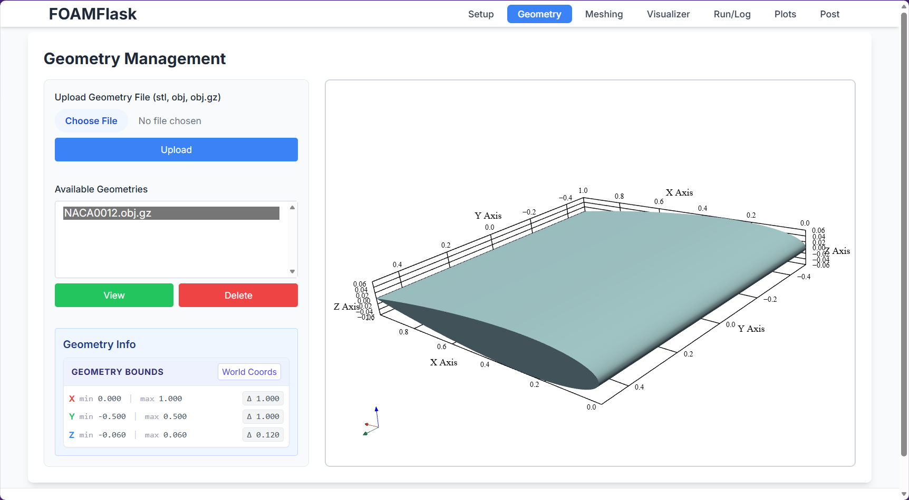

[](https://opensource.org/licenses/GPL-3.0)
[](https://www.python.org/)
[](https://flask.palletsprojects.com/)
[](https://www.typescriptlang.org/)
[](https://tailwindcss.com/)
[](https://openfoam.org/)
[](https://pdoc3.readthedocs.io/)

# FOAMFlask

**FOAMFlask** is an attempt to make a yet another lightweight web-based GUI for managing and running **OpenFOAM** tutorials and simulations. It allows users to easily select a tutorial, set a case directory, and execute OpenFOAM commands directly from a browser. Since this is targeted for beginners, the documentation has been kept as extensive as possible.

**Important**

1. Currently only loading and execution of OpenFOAM tutorials (`$FOAM_TUTORIALS`) is supported. Creating custom cases is planned.
2. Always edit files in `static/ts/` directory, never directly in `static/js/`. The `static/js/` files are overwritten during the build process.

---

## Features

- Web interface for OpenFOAM case management.
- Persistently store the **CASE_ROOT** across sessions.
- Load and copy tutorials from the OpenFOAM tutorials directory.
- Run common OpenFOAM commands (`blockMesh`, `simpleFoam`, `pimpleFoam`) with live output.
- Color-coded console output for stdout, stderr, info, and tutorial messages.
- Fully compatible with OpenFOAM 2506 (adjustable for other versions).
- **Security-hardened command execution** with input validation and injection protection.

---

## Installation

You have two options: Download a pre-built binary (easiest) or build from source using the automated installer.

### Option 1: Standalone Application (Recommended)

1. Go to the [Releases](https://github.com/dhruvhaldar/FOAMFlask/releases) page.
2. Download the executable for your OS:
   - **Windows**: `FOAMFlask-Windows.exe`
   - **Linux**: `FOAMFlask-Linux`
   - **macOS**: `FOAMFlask-MacOS`
3. **Prerequisite**: Ensure [Docker Desktop](https://www.docker.com/products/docker-desktop/) is installed and running.
4. Run the executable. It will automatically launch the server.

### Option 2: Build from Source (Automated)

Clone the repository and run the installer script. This will automatically check for and attempt to install dependencies (Python, Node.js, pnpm), build the frontend, and start the app.

<details>
<summary><strong>Windows</strong></summary>

```powershell
git clone https://github.com/dhruvhaldar/FOAMFlask
cd FOAMFlask
.\install.ps1
```

</details>

<details>
<summary><strong>Linux / macOS</strong></summary>

```bash
git clone https://github.com/dhruvhaldar/FOAMFlask
cd FOAMFlask
chmod +x install.sh
./install.sh
```

</details>

### Option 3: Manual Installation (Developers)

If you prefer to manage the environment yourself:

1. **Install Prerequisites**: Python 3.12+, Node.js 20+, pnpm 8+, and Docker.
2. **Install Frontend**:
   ```bash
   pnpm install
   pnpm run build
   ```
3. **Install Backend**:
   ```bash
   python -m venv venv
   source venv/bin/activate  # or .\venv\Scripts\activate on Windows
   pip install -r requirements.txt
   ```
4. **Run**:
   ```bash
   python app.py
   ```

## Usage

1. **Start the Application**:
   - If using the binary, just double-click it.
   - If using source, run `python app.py`.

2. **Access the web interface**:
   Open your browser and navigate to `http://localhost:5000`.

2. **Access the web interface**:
   Open your browser and navigate to `http://localhost:5000`.

3. **Set a case directory**:
   Enter a path for your simulation cases.
   Click `Set Case Dir`.

4. **Set OpenFOAM root directory**:
   Enter a path for your OpenFOAM root directory.
   Click `Set OpenFOAM Root`.

5. **Load a tutorial**:
   Select a tutorial from the dropdown.
   Click `Load Tutorial`.
   The tutorial will be copied to your selected case directory.

6. **Run OpenFOAM commands**:
   Use the buttons (blockMesh, simpleFoam, pimpleFoam) to execute commands.
   Live output is shown in the console panel.

7. **Realtime Plotting**:
   - Click "Show Plots" to enable realtime polling of OpenFOAM results.
   - Plots update every 2 seconds.
   - For aerodynamic cases, click "Show Aero Plots" to see Pressure Coefficient (Cp) and Velocity Profiles.

---

## Development

> [!NOTE]
> This section is intended for developers who wish to contribute to or modify FOAMFlask.

### Project Structure

```text
FOAMFlask/
├── app.py # Main Flask application
├── case_config.json # Stores the last used CASE_ROOT
├── package.json # Node.js dependencies and build scripts
├── tsconfig.json # TypeScript configuration
├── copy-built-js.mjs # Custom build script
├── requirements.txt # Python dependencies
├── static/
│ ├── html/
│ │ └── foamflask_frontend.html # HTML template
│ ├── ts/
│ │ └── foamflask_frontend.ts # TypeScript source code
│ ├── js/
│ │ ├── foamflask_frontend.js # Compiled JavaScript (for browser)
│ │ └── frontend/
│ │     └── isosurface.js # PyVista integration
│ ├── js-build/
│ │ └── foamflask_frontend.js # TypeScript compiler output
├── backend/
│ ├── geometry/
│ │ └── manager.py # Geometry management utilities
│ ├── mesh/
│ │ └── mesher.py # Mesh generation utilities
│ ├── plots/
│ │ └── realtime_plots.py # Real-time plotting backend
│ ├── post/
│ │ └── isosurface.py # Post-processing utilities
│ ├── verification/
│ │ └── verify_changes.py # Verification utilities
├── test/
│ ├── check_coverage.py # Code coverage analysis script
│ ├── check_docstrings.py # Docstring coverage checker
│ ├── docker_test.py # Docker functionality tests
│ ├── pyvista_test.py # PyVista integration tests
│ ├── foamlib_test.py # FOAM library tests
│ └── bike.vtp # Test VTK file
├── docs/ # Generated documentation
├── environments/ # Python virtual environments
└── README.md # This file
```

### Key Locations

- **Backend Source**: `app.py` & `backend/`
- **Frontend Source**: `static/ts/`
- **Frontend Template**: `static/html/`

### Frontend Development Workflow

1. **Make changes** to the TypeScript files in `static/ts/`.
2. **Compile to JavaScript**:
   You must compile the TypeScript to JavaScript for the browser to run it.
   ```bash
   npm run build        # One-time build
   npm run build:watch  # Wrapper to watch for changes
   ```
3. **Run the backend** (see Usage section) and refresh your browser.

### Backend Development Workflow

1. **Add/Modify Logic**:
   - Create new modules in `backend/` for organized logic (e.g., new file parsers, simulation controllers).
   - Import them in `app.py`.
2. **Add Endpoints**:
   - Define new routes in `app.py` using `@app.route`.
3. **Restart the server**:
   - Flask's debug mode (default) usually auto-reloads on python file changes.

---

### Tech Stack & Frameworks

This project is built with robustness and simplicity in mind, avoiding heavy frontend frameworks in favor of a clean, performant architecture.

- **Backend**:

  - **Python 3.13+**: Core logic.
  - **Flask**: Lightweight WSGI web application framework.
  - **Docker SDK (`docker-py`)**: For programmatic control of Docker containers.
  - **PyVista / VTK**: For mesh processing and isosurface generation.
  - **Custom Parsers**: Dedicated Python parsers (`realtime_plots.py`) for reading both uniform and nonuniform OpenFOAM fields.

- **Frontend**:

  - **TypeScript**: For type-safe, maintainable client-side code.
  - **Vanilla DOM API**: No React/Vue/Angular. Direct DOM manipulation for maximum performance.
  - **TailwindCSS**: Utility-first CSS framework for styling.
  - **Plotly.js**: For responsive, interactive charts (using data served by Flask endpoints).

- **Architecture**:
  - RESTful API for client-server communication.
  - **Stateless Backend**: The server does not maintain session state; state is managed by the client or persisted to disk.

---

## FAQ

### Docker Desktop Warning (Windows)

**Issue Description**: Warning on the backend console:`WARNING:FOAMFlask:[FOAMFlask] get_tutorials called but Docker Desktop is not running`. Frontend shows empty drop down for `Load Tutorial`.

**Explanation**: This means the application is trying to access Docker Desktop but it's either not running or not installed.

**Resolution**: Here's how to resolve this:

1. Install Docker Desktop (if not already installed):

   - Download from [Docker's official website](https://www.docker.com/products/docker-desktop/)
   - Follow the installation instructions for your operating system
   - This build was tested on 4.45.0 (203075)

2. Start Docker Desktop

   - Launch Docker Desktop before running the FOAMFlask application
   - Wait for Docker to fully start (you'll see the Docker icon `Docker Desktop running` in your system tray/menu bar)

3. Restart FOAMFlask after Docker is running

4. In Docker Desktop settings, you have the option `Start Docker Desktop when you sign in to your computer` to ensure Docker Desktop runs automatically the next time you login.

### Docker Socket Permissions (Linux)

**Issue Description**: "Permission denied" error when trying to access the Docker socket (e.g., cannot connect to Docker daemon).

**Explanation**: The application needs to communicate with the Docker daemon, but your user does not have permission to access the Unix socket `/var/run/docker.sock`.

**Resolution**:

1. Add your user to the `docker` group:

   ```bash
   sudo usermod -aG docker $USER
   ```

2. Apply the group changes:

   - **Method A (Temporary)**: Run `newgrp docker` in your current terminal.
   - **Method B (Permanent)**: Log out and log back in (recommended).
   - **Method C**: Restart your computer.

3. Verify access:
   ```bash
   docker run --rm hello-world
   ```

### File Permissions (Linux)

**Issue Description**: Files created by the OpenFOAM container (e.g., tutorial files, logs) are owned by `root` and cannot be deleted by the user.

**Explanation**: By default, Docker containers run as root, so any files they write to the host system via bind mounts are owned by root.

**Resolution**: FOAMFlask includes an automated startup check to handle this:

1. On the first run, it performs a "dry run" by launching a container to write a test file.
2. It attempts to delete this file.
3. If deletion fails (Permission Denied), it detects the issue and automatically configures future containers to run with your current user ID (UID) and group ID (GID).
4. This ensures all subsequent files created by OpenFOAM are owned by you.

You will see a "System Check" modal on startup while this verification takes place.

### Startup Checks

On the first run, FOAMFlask performs several checks to ensure your environment is correctly configured:

1. **Docker Installation**: Checks if the Docker executable is in your system PATH.
2. **Permissions**: Verifies that the current user can run Docker commands (without sudo).
3. **Image Availability**: Checks if the required OpenFOAM Docker image exists.
   - If missing, it will automatically pull the image.
   - **Note**: This is a large download (several GBs). A warning will be displayed for metered connections.
4. **File Permissions**: As mentioned above, it ensures container-generated files are owned by you.

---

## IMPORTANT: Docker Configuration

The application uses specific bind mount paths to ensure compatibility with different user permissions (especially on Linux).

> [!CAUTION] > **Do NOT modify the internal container mount paths** in `app.py` or `backend/startup.py`.
> The application is configured to mount cases to `/tmp/FOAM_Run` inside the container. This `/tmp` path is critical because it ensures the directory is writable by ANY user (including your non-root host user).
> Changing this back to `/home/foam` or other strict directories will cause "Permission Denied" errors on Linux systems.

> [!NOTE] > **Security Suppression**: You may see `# nosec B108` comments in the code near these paths. This is required to suppress Bandit security warnings because `/tmp` is a hardcoded path, which is flagged by default but is safe and intentional in this Docker container context.

### Network Binding

By default, the application binds to `0.0.0.0` (all interfaces) to ensure it is accessible when running inside a container.

To change this behavior (e.g., for local development security), you can set the `FLASK_HOST` environment variable:

- **Container/Public Access (Default)**: `FLASK_HOST=0.0.0.0`
- **Localhost Only (Secure)**: `FLASK_HOST=127.0.0.1`

On startup, the application logs the listening address: `FOAMFlask listening on: {host}:{port}`

> [!NOTE] > **Security Suppression**: You may see `# nosec B104` in `app.py`. This suppresses the Bandit warning for binding to all interfaces, which is intentional for the containerized deployment strategy.

---

## Testing

FOAMFlask includes a comprehensive test suite using pytest. The test suite includes unit tests, integration tests, and end-to-end tests for the application's core functionality.

### Running Tests

1. **Install test dependencies** (if not already installed):

   ```bash
   pip install -r requirements.txt
   ```

2. **Run all tests** with coverage:

   ```bash
   # Run all tests with coverage
   pytest --cov=app --cov=backend --cov-report=term-missing --cov-report=html
   ```

3. **Run specific test files** or individual tests:

   ```bash
   # Run a specific test file
   pytest test/test_app.py -v

   # Run a specific test function
   pytest test/test_app.py::test_index_route -v
   ```

4. **Run tests in parallel** (faster execution):
   ```bash
   pytest -n auto --cov=app --cov=backend
   ```

### Test Coverage

To check test coverage and generate reports:

```bash
# Generate HTML coverage report (recommended)
pytest --cov=app --cov=backend --cov-report=html

# View coverage in terminal
pytest --cov=app --cov=backend --cov-report=term-missing

# Generate XML report (for CI/CD integration)
pytest --cov=app --cov=backend --cov-report=xml
```

**Coverage Reports**:

- HTML report will be generated in the `htmlcov` directory
- Open `htmlcov/index.html` in your browser to view the detailed coverage report
- The terminal report shows which lines are missing coverage

### Test Structure

```
test/
├── conftest.py        # Test fixtures and configuration
├── test_app.py        # Main application tests
└── test_security.py   # Security-related tests
```

### Writing New Tests

1. Create a new test file following the naming convention `test_*.py`
2. Use pytest fixtures from `conftest.py` when available
3. Follow the existing test patterns for consistency
4. Include docstrings explaining what each test verifies

### Test Coverage Commands Reference

```bash
# Run all tests with coverage
pytest --cov=app --cov=backend

# Run tests without coverage
pytest

# Run tests with detailed output
pytest -v

# Run tests and stop after first failure
pytest -x

# Run tests and show output from print statements
pytest -s

# Run tests matching a specific pattern
pytest -k "test_name_pattern"
```

---

## Screenshots



---

## License

FOAMFlask is released under the [GPLv3](https://www.gnu.org/licenses/gpl-3.0.en.html) License.
